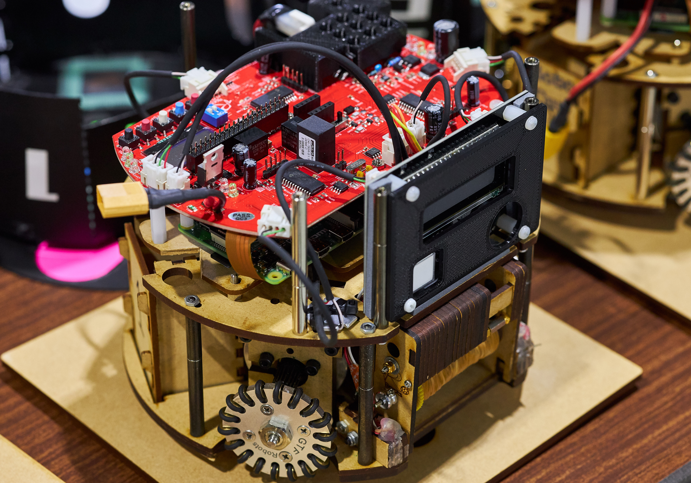

# FrootsPi

FrootsPiを動かすROS 2パッケージです。



## Requirements

- FrootsPi
- Raspberry Pi (Raspberry Pi 4推奨)
- Ubuntu 20.04
- ROS 2 Foxy
- [pigpio](http://abyz.me.uk/rpi/pigpio/)
- [SSL-Roots/consai_frootspi_msgs](https://github.com/SSL-Roots/consai_frootspi_msgs)

## Installation

### Install pigpio

http://abyz.me.uk/rpi/pigpio/download.html
を参照

```sh
$ git clone https://github.com/joan2937/pigpio
$ cd pigpio
$ make
$ sudo make install
# Install setup tools for Python interface.
$ sudo apt install python-setuptools python3-setuptools
```

### Install simpleaudio

```sh
$ sudo apt install -y python3-pip libasound2-dev
$ pip3 install simpleaudio
```

### Install FrootsPi

```sh
$ mkdir -p ~/ros2_ws/src
$ cd ~/ros2_ws/src
$ git clone https://github.com/SSL-Roots/FrootsPi
$ git clone https://github.com/SSL-Roots/frootspi_msgs.git
$ git clone https://github.com/SSL-Roots/consai_frootspi_msgs.git

# Install dependencies
$ rosdep install -r -y --from-paths . --ignore-src

$ cd ~/ros2_ws
$ colcon build --symlink-install

# RasPi3ではメモリ不足によりビルドがフリーズすることがあります
# その場合はこちらのコマンドを実行します
$ MAKEFLAGS=-j1 colcon build --executor sequential --symlink-install
$ source ~/ros2_ws/install/setup.bash
```

### GPIOの初期化

[SSL-Roots/init_frootspi_gpio_script](https://github.com/SSL-Roots/init_frootspi_gpio_script) のスクリプトを実行してください。

## Examples

### Start frootspi

GPIO19にスイッチを接続し、次のコマンドを実行。

```sh
# pigpioデーモンの起動（ログアウトするまで再実行不要）
# オプション設定でサンプルレートを1に設定（PWM周波数を40kHzに設定するために必要）
$ sudo pigpiod -s 1
$ source ~/ros2_ws/install/setup.bash
$ ros2 launch frootspi_examples hardware.launch.py 
```

トピック`/switch_state`がパブリッシュされます。

```sh
$ ros2 topic echo /switch_state
```

### Joystickを用いた動作確認
1. 手持ちのJoystickをRaspberryPiに接続します。
2. `frootspi_examples/launch/joycon.launch.py` の `joy_config` が、手持ちのJoystickに対応したコンフィグに設定されていることを確認します。
3. 次のコマンドを実行します

    ```sh
    ros2 launch frootspi_examples joycon.launch.py

    # 別のターミナル
    ros2 launch frootspi_examples robot.launch.py
    ```

### 自動起動設定
RaspberryPi起動時に自動的にロボットのファームウェアが起動するように設定できます。  
以下をRaspberryPiのターミナルで実行してください。

```
~/ros2_ws/src/FrootsPi/frootspi_examples/systemd/register_systemd.sh 
```

## License

(C) 2021 Roots

各ファイルはファイル内に明記されているライセンスに従います。
ライセンスが明記されていない場合は、Apache License, Version 2.0に従います。
ライセンスの全文は[LICENSE](./LICENSE)から確認できます。

## Development

FrootsPiを開発する際にここを読んでください。

### 開発方針について

- 本ソフトウェアはオープンソースですが、開発はオープンではありません
- チームの開発方針を優先するため、外部からのIssue、Pull Requestには対応できない場合があります

### Lint

コードの見た目を整えるためにlintでチェックしています。

下記コマンドを実行して、チェックを実行してください。

```sh
$ cd ~/ros2_ws
$ colcon test
$ colcon test-result --verbose
```

C++のコードは`ament_uncrustify`を使って、自動で整形できます。

```sh
$ cd frootspi_hardware/src
$ ament_uncrustify --reformat driver_component.cpp
```
